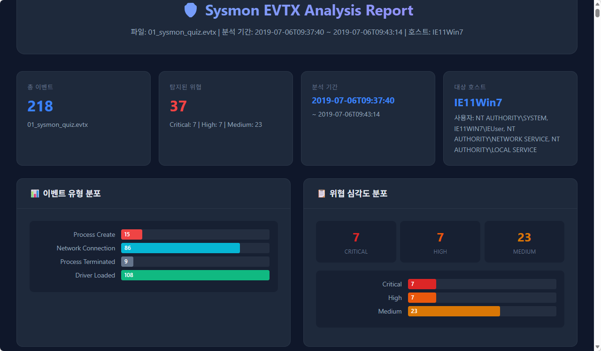
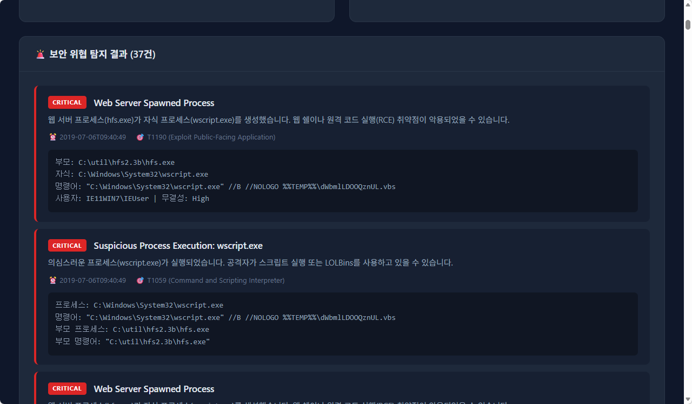
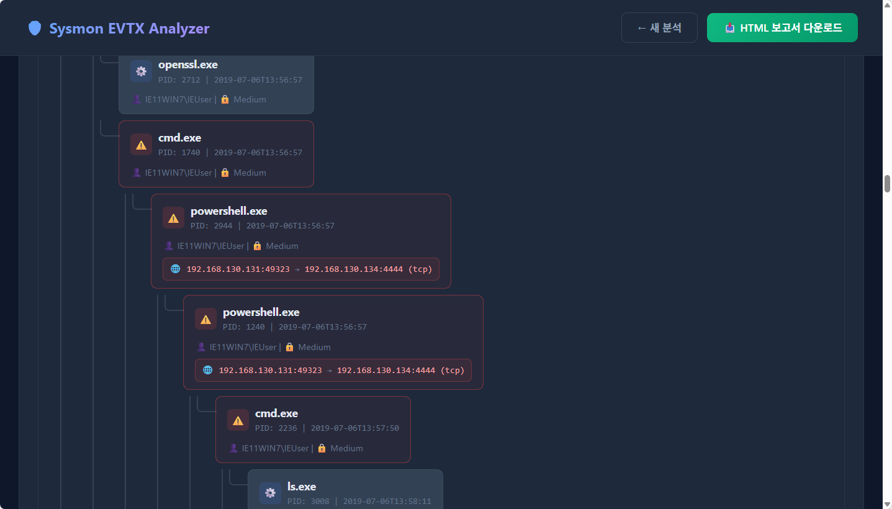
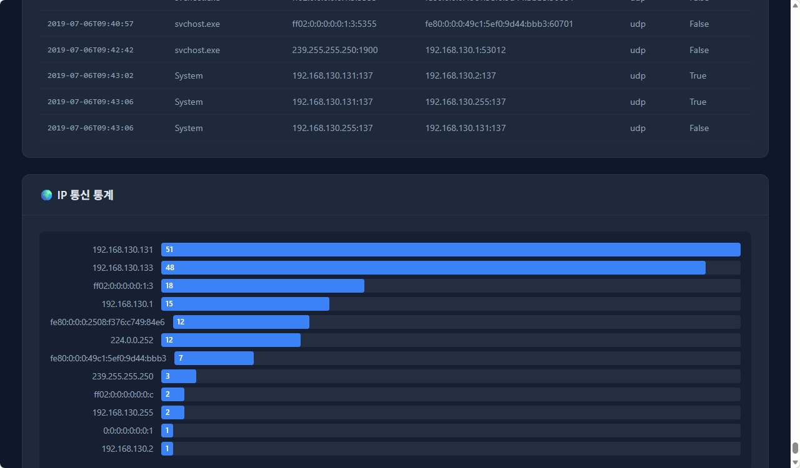

# Sysmon EVTX Analyzer

A Flask-based web application that parses Windows Sysmon EVTX event logs, visualizes events on an interactive timeline, detects security threats using MITRE ATT&CK mappings, and generates downloadable HTML reports.

## Screenshots

### Dashboard Overview

*Event statistics, type distribution (SVG donut chart), and threat severity breakdown at a glance.*

### Security Threat Detection

*Automated threat detection with severity levels (Critical / High / Medium), detailed descriptions, MITRE ATT&CK technique IDs, and expandable forensic details.*

### Process Tree (Parent-Child Relationship)

*Interactive process tree showing parent-child execution chains with associated network connections. Suspicious processes are highlighted with warning indicators, and known attack ports (e.g., 4444) are flagged in red.*

### Network Analysis & IP Statistics

*Network connection table with source/destination tracking and IP communication frequency chart.*

## Features

- **EVTX Parsing** — Drag-and-drop upload or analyze a bundled sample file instantly
- **Process Tree Visualization** — Interactive parent-child process relationship graph:
  - Hierarchical tree layout with visual connectors showing execution chains
  - Network connections displayed inline on each process node
  - Suspicious processes highlighted with warning icons and red borders
  - Virtual parent nodes for processes whose parents are not captured in the log
  - Attack chain auto-detection (e.g., `hfs.exe → wscript.exe → payload.exe → cmd.exe`)
  - Click-to-expand detailed forensic information (full path, command line, all network connections)
- **Timeline Visualization** — Chronological event timeline with color-coded event types and filtering
- **Threat Detection** — Rule-based engine that identifies suspicious behaviors:
  - Web server spawning child processes (RCE / web shell indicators)
  - Suspicious process execution (LOLBins: `wscript.exe`, `cmd.exe`, `powershell.exe`, etc.)
  - Malicious script execution (`.vbs`, `.ps1`, `.bat`, `.hta`)
  - Connections on known suspicious ports (4444, 31337, etc.)
  - Unsigned or invalid driver loading (rootkit indicators)
  - Elevated privilege execution
- **MITRE ATT&CK Mapping** — Each detected threat is tagged with the relevant technique (T1190, T1059, T1071, etc.)
- **Interactive Charts** — Pure SVG/CSS charts with no external JavaScript dependencies:
  - Event type distribution (donut chart)
  - Time-based event heatmap (stacked bar chart)
  - Threat severity distribution (donut chart)
  - IP communication statistics (horizontal bar chart)
- **HTML Report Download** — Export analysis results as a self-contained, standalone HTML file
- **Modern Dark UI** — Clean, responsive interface optimized for security analysis workflows

## Supported Sysmon Event Types

| Event ID | Name | Description |
|----------|------|-------------|
| 1 | Process Create | New process creation with full command line |
| 3 | Network Connection | TCP/UDP network connection with IP and port |
| 5 | Process Terminated | Process exit events |
| 6 | Driver Loaded | Kernel driver loading with signature verification |

## Getting Started

### Prerequisites

- Python 3.10+

### Installation

```bash
# Clone the repository
git clone https://github.com/ngnicky-ai/sysmon-evtx-analyzer.git
cd sysmon-evtx-analyzer

# Install dependencies
pip install -r requirements.txt
```

### Running

```bash
python app.py
```

Open your browser and navigate to **http://127.0.0.1:5000**

### Usage

1. **Upload an EVTX file** — Drag and drop a `.evtx` file onto the upload area, or click to browse
2. **Review the analysis** — Explore the dashboard with event statistics, timeline, and charts
3. **Investigate threats** — Click on threat cards to expand forensic details
4. **Filter events** — Use the filter buttons to focus on specific event types or severity levels
5. **Download the report** — Click the green download button to save a standalone HTML report

## Project Structure

```
sysmon-evtx-analyzer/
├── app.py                          # Flask application (parsing, detection, routing)
├── requirements.txt                # Python dependencies
├── templates/
│   ├── index.html                  # Upload page
│   ├── result.html                 # Analysis dashboard with interactive charts
│   └── report_download.html        # Standalone HTML report template
└── results_img/                    # Sample screenshots
    ├── sysmon_01.png
    ├── sysmon_02.png
    ├── sysmon_03.png
    └── sysmon_04.png
```

## Tech Stack

- **Backend** — Python, Flask
- **EVTX Parsing** — [evtx](https://pypi.org/project/evtx/) (Rust-based parser with Python bindings)
- **Frontend** — Pure HTML/CSS/SVG (zero JavaScript library dependencies for charts)
- **Threat Detection** — Custom rule engine with MITRE ATT&CK framework mapping

## License

This project is open source and available under the [MIT License](LICENSE).
